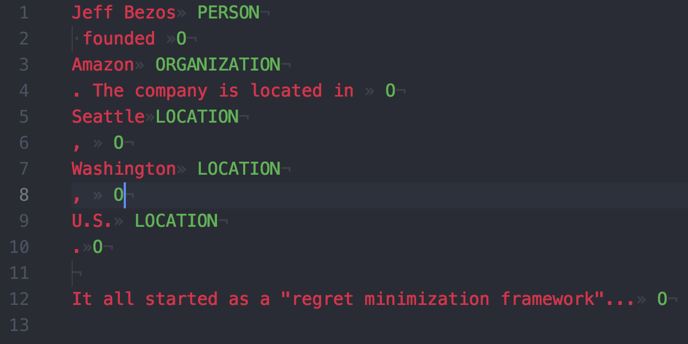
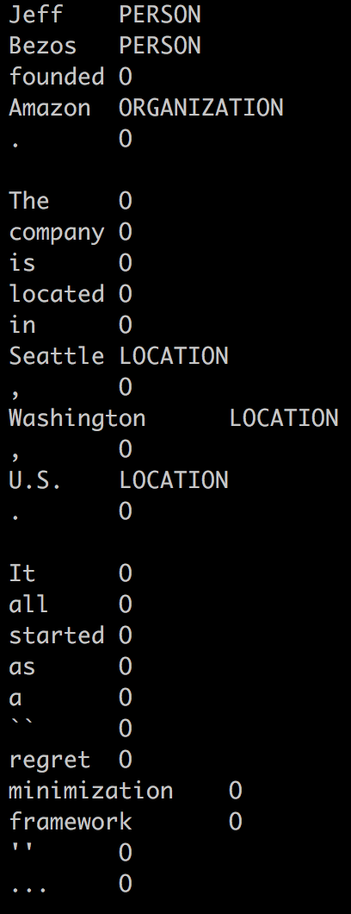

Tabulated format to represent an annotated document's **entities**. The main characteristics are:

* A document's text is divided into chunks of text, splitting annotated entities vs. non-annotated text.
* The first column has the ordered chunks of text, whereas the second column their entity labels
  * Non-annotated text is labeled as `O` (for _Outside_).
  * Annotated entity text is labeled as the corresponding entity type's name (e.g. _Person_ or _Location_).

* Annotations other than entities are not represented in this format.
* **Overlapping entities are not supported**: when two overlapping entities are detected, the first one (as in the string start offset) is arbitrarily chosen over the other. If you work with overlapping entities, you could use the similar format [EntitiesOnlyClassesTsv](https://docs.tagtog.net/EntitiesOnlyClassesTsv), or the full-featured format [anndoc](https://docs.tagtog.net/anndoc.html).

The `EntitiesTsv` format closely resembles the `tsv` output by the Stanford NER tool as briefly shown [here](https://nlp.stanford.edu/software/crf-faq.shtml#j) and [here (see _outputFormat_)](https://nlp.stanford.edu/software/CRF-NER.shtml). The main differences are that in `EntitiesTsv`:

* **the text is NOT tokenized**
* the spaces are preserved
* sentences are not segmented

This is to give freedom to the user to choose later any desired text tokenizer. If the user still wants to use Stanford's default tokenizer, [this is the corresponding java class](https://nlp.stanford.edu/nlp/javadoc/javanlp/edu/stanford/nlp/process/PTBTokenizer.html).

## Example

The format is best explained with an example 🙂:

* From the annotated document (_input_):

* The resulting _output_ is (the `»` character represents a tab, `·` a space, and `¬` a new line):

---

As a comparison, the Stanford NER tsv format would yield for the same text the output (as running `java -mx600m -cp ".:*:lib/*" edu.stanford.nlp.ie.crf.CRFClassifier -loadClassifier classifiers/english.all.3class.distsim.crf.ser.gz -outputFormat tsv -textFile my-sample.txt 2>/dev/null`):

